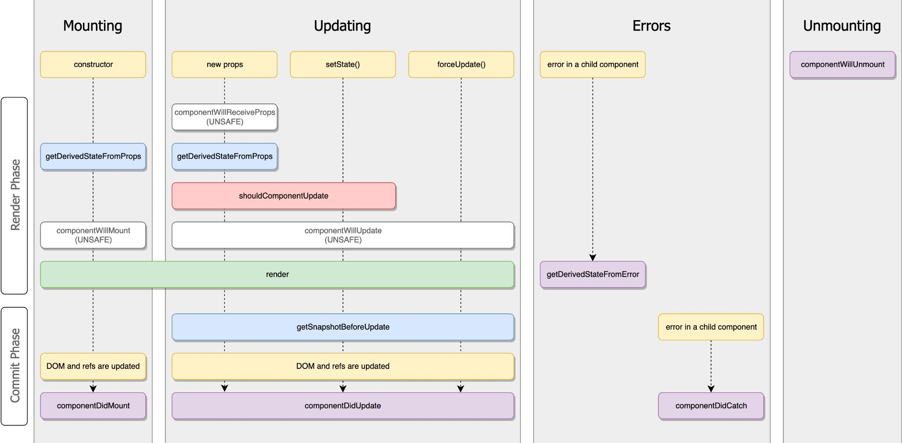

# Основы react

**React** — это библиотека, которая предназначена для обновления **DOM браузера**.

Для работы с **React** в браузере необходимо импортировать две библиотеки: **React** и **ReactDOM**. **React** — это библиотека для создания представлений. **ReactDOM** — это библиотека для рендеринга пользовательского интерфейса в браузере.

В **SPA** браузер изначально загружает один **HTML-документ.** Перемещаясь по сайту, пользователи фактически остаются на той же странице. **JavaScript** уничтожает пользовательский интерфейс и создает новый всякий раз, когда пользователь взаимодействует с приложением.


```jsx
React.createElement("h1", { id: "recipe-0" }, "Baked Salmon");
```


Первый аргумент определяет тип элемента. Второй аргумент определяет свойства элемента. Третий аргумент соответствует дочерним элементам: это могут быть любые узлы, вставленные между открывающим и закрывающим тегами.

**JSX** — это расширение **JavaScript**, которое позволяет определять элементы **React** с использованием синтаксиса тегов непосредственно в коде **JavaScript**.


По умолчанию React DOM экранирует все значения, включённые в JSX перед тем как отрендерить их. Это гарантирует, что вы никогда не внедрите чего-либо, что не было явно написано в вашем приложении. Всё преобразуется в строчки, перед тем как быть отрендеренным. Это помогает предотвращать атаки межсайтовым скриптингом (XSS).


Мы используем операторы **import**, которые в настоящее время не поддерживаются большинством **браузеров и Node.js**. Они работают лишь потому, что **Babel** преобразует их в операторы **require('module/path')**. Функция **require** обычно используется для загрузки модулей **CommonJS**.

**Рендеринг (rendering)** — это основа приложения **React**. Когда что-то изменяется (**свойства, состояние**), дерево компонентов отображается заново, показывая новые данные в виде пользовательского интерфейса.


**Рендеринг** происходит при первой загрузке приложения и при изменении значений свойств и состояния.


**Компонент** — это просто функция, которая отображает пользовательский интерфейс.&#x20;


React-компоненты обязаны вести себя как чистые функции по отношению к своим пропсам.

В React-приложениях, имеет ли компонент состояние или нет — это внутренняя деталь реализации компонента, которая может меняться со временем. Можно использовать компоненты без состояния в компонентах с состоянием, и наоборот.


## Методы жизненного цикла

#### React работает в два этапа:

1. Этап рендеринга (render phase) определяет, какие изменения необходимо произвести, например, в DOM. В течение этого этапа React вызывает render, а затем сравнивает полученный результат с результатом предыдущего рендера.&#x20;
2. Этап фиксации (commit phase) — в нём React применяет любые изменения. В случае React DOM — это этап, когда React вставляет, обновляет и удаляет DOM-узлы. В течение этого этапа React вызывает методы жизненного цикла componentDidMount и componentDidUpdate

#### Этап рендеринга включает в себя следующие методы жизненного цикла:

1. constructor componentWillMount (или UNSAFE\_componentWillMount)
2. componentWillReceiveProps (или UNSAFE\_componentWillReceiveProps)
3. componentWillUpdate (или UNSAFE\_componentWillUpdate)&#x20;
4. getDerivedStateFromProps&#x20;
5. shouldComponentUpdate
6. render&#x20;
7. Функции обновления setState (первый аргумент)

<figure><figcaption></figcaption></figure>



